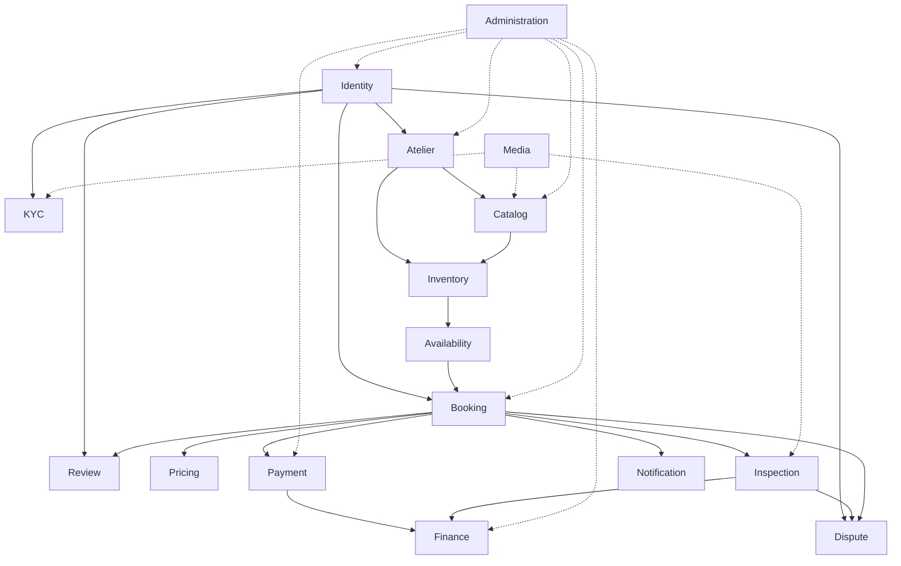
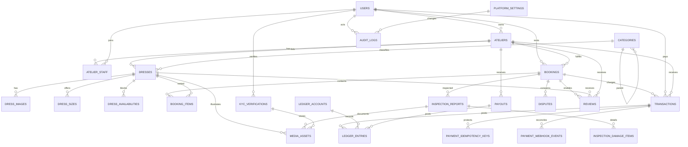
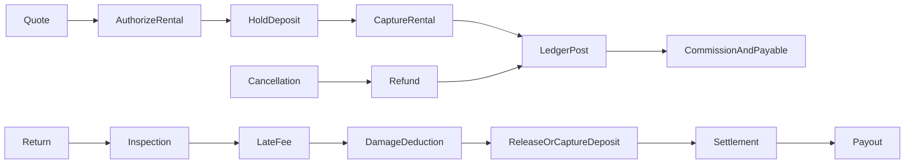

# Phase 0 - Architecture Lock

**System:** Dress Rental & Atelier Marketplace
**Deployment:** One Laravel modular monolith
**Status:** Architecture proposed for implementation approval

This document is the Phase 0 boundary. It contains architecture and product
contracts only. Phase 1 must not begin until this document is accepted and the
foundation gates are agreed.

## 1. Architecture Map

```text
Browser
  -> Inertia HTTP interface (Laravel controllers, requests, policies)
  -> Application layer (commands, queries, DTOs, actions)
  -> Domain layer (entities, value objects, state machines, domain events)
  -> Infrastructure layer (Eloquent repositories, queues, storage, gateways)
  -> MySQL 8.4 / Redis-Valkey / private object storage
```

The application is one deployable unit. Modules are PHP namespaces and
directory boundaries, not separate services. A module's `Domain` and
`Infrastructure` internals are private. Other modules use only the owning
module's published contracts, application services, DTOs, or events.

Shared framework concerns are limited to authentication plumbing, bus/event
dispatching, persistence primitives, validation, authorization, storage, and
observability. Business rules remain in modules.

## 2. Module Map and Ownership

| Module | Owns | Public surface |
|---|---|---|
| Identity | Users, credentials, roles, permissions, sessions | `IdentityReader`, user/permission DTOs |
| Atelier | Ateliers, staff membership, approval, scope | `AtelierReader`, `AtelierAccess`, atelier DTOs |
| Catalog | Categories, dresses, sizes, presentation metadata | `CatalogReader`, `DressManagement`, catalog DTOs |
| Inventory | Operational dress state and controlled transitions | `InventoryReader`, `InventoryStateManager` |
| Availability | Date holds, conflict checks, buffers, calendar projection | `AvailabilityContract` |
| Booking | Booking aggregate, items, lifecycle, fitting, cancellation | `BookingContract`, booking commands/events |
| Pricing | Server-side rental quotes, taxes, fees, discounts, deposits | `PricingContract` |
| Payment | Gateway transactions, authorization/capture/refund/webhooks | `PaymentContract` |
| Finance | Accounts, balanced journal entries, commission, payables, payouts | `LedgerContract`, `SettlementContract` |
| Inspection | Inspection reports, damage items, finalization | `InspectionContract` |
| KYC | Verification records and decisions; document references | `KycContract`, protected document access |
| Dispute | Dispute lifecycle and resolution records | `DisputeContract` |
| Review | Eligibility, ratings, reviews, atelier replies | `ReviewContract` |
| Notification | Notification templates, channels, delivery orchestration | `NotificationContract` |
| Media | Upload validation, transformations, references, private/public storage policy | `MediaContract` |
| Administration | Platform operations, moderation, configuration, audit queries | Admin use cases; never direct business mutation |

Every module follows:

```text
app/Modules/<Module>/
  Domain/{Entities,ValueObjects,Events,Exceptions,Contracts}
  Application/{Actions,Commands,Queries,DTOs,Services}
  Infrastructure/{Persistence,Repositories}
  Http/{Controllers,Requests,Resources}
  Providers/
```

`Audit` is a cross-cutting capability owned by Administration and exposed as
an append-only `AuditWriter` contract. It does not become a general business
module.

## 3. Dependency Graph

Solid arrows are synchronous contract calls. Dotted arrows are event-driven
reactions. No reverse private dependency is permitted.



Administration invokes public application use cases and read contracts. It
never writes another module's tables. Notification, Media, and Finance react
to published events where decoupling is useful. Event handlers must be
idempotent.

## 4. Module Contracts

| Contract | Required operations | Consumers |
|---|---|---|
| `AtelierReader` | resolve approved atelier; verify staff scope | Catalog, Inventory, Admin |
| `CatalogReader` | read dress snapshot, size snapshot, publication state | Availability, Booking, Storefront |
| `InventoryStateManager` | reserve, mark rented, mark cleaning/maintenance, retire | Booking, Inspection, Admin |
| `AvailabilityContract` | quote operational range; assert available; create/release hold | Booking |
| `PricingContract` | calculate immutable quote from dates and snapshots; late-fee quote | Booking, Payment, Inspection |
| `BookingContract` | read booking snapshot; execute named transition; record fitting/cancellation | Payment, Inspection, Dispute, Review |
| `PaymentContract` | authorize, capture, void, refund, hold/release/capture deposit | Booking, Finance, Inspection |
| `LedgerContract` | post balanced journal, query balance, reconcile transaction | Payment, Inspection, Admin |
| `SettlementContract` | calculate payable/commission; create payout | Finance/Admin |
| `InspectionContract` | create report, add damage, finalize report, read result | Booking, Finance, Dispute |
| `KycContract` | submit, review, status query, authorized document stream | Identity, Booking, Admin |
| `DisputeContract` | open, classify, resolve/reject, read case | Booking, Payment, Admin |
| `ReviewContract` | assert eligibility, publish review, reply | Booking, Catalog, Admin |
| `NotificationContract` | enqueue named notification to recipient(s) | all modules |
| `MediaContract` | validate/store asset, create thumbnail, authorized stream/delete | Catalog, Inspection, KYC |
| `AuditWriter` | append action with actor, old/new values, request context | all mutation modules |

Contracts accept scalar identifiers and immutable DTOs, never Eloquent models
or repositories from another module. A contract call must not expose a private
table as a mutable object.

## 5. Database Ownership and ERD

All tables use InnoDB, `utf8mb4`, UTC timestamps, decimal money columns, and
foreign keys where ownership is local or the reference is stable. Cross-module
references are IDs/snapshots and are changed through contracts.



### Ownership map

| Owner | Tables |
|---|---|
| Identity | `users`, `roles`, `permissions`, role/permission pivots |
| Atelier | `ateliers`, `atelier_staff` |
| Catalog | `categories`, `dresses`, `dress_images`, `dress_sizes` |
| Availability | `dress_availabilities` |
| Booking | `bookings`, `booking_items` |
| Payment | `transactions`, `payment_idempotency_keys`, webhook records |
| Finance | `ledger_accounts`, `ledger_entries`, payable/payout records |
| Inspection | `inspection_reports`, `inspection_damage_items` |
| KYC | `kyc_verifications` |
| Dispute | `disputes` |
| Review | `reviews` |
| Media | media asset/reference records |
| Administration | `audit_logs`, platform settings |

Important constraints include unique booking reference/SKU/slug, unique
atelier-staff membership, unique ledger account code, transaction and
idempotency keys, rating range checks, non-negative money checks, and the
availability index `(dress_id, start_date, end_date)`. Confirmed booking
overlap is protected by a transaction plus pessimistic locking; a database
range-exclusion constraint is not available in MySQL and is not assumed.

## 6. Role and Permission Matrix

Permissions are capabilities, not merely role names. Every policy additionally
checks ownership, atelier scope, lifecycle state, and KYC/privacy rules.

| Capability | Superadmin | Atelier owner/manager | Atelier staff | Renter |
|---|---:|---:|---:|---:|
| Manage users/roles | Full | No | No | Self only |
| Approve atelier/KYC | Full | No | No | Submit own KYC |
| Manage own catalog | Full | Own atelier | Scoped by grant | Read published |
| Manage inventory | Full | Own atelier | Inventory grant | No |
| View/manage bookings | Full | Own atelier | Assigned/scoped | Own bookings |
| Create/cancel booking | Admin action | No | No | Own booking, rules apply |
| Take payment/refund | Oversight/use case | No | No | Own payment initiation |
| Inspect/assess damage | Full | Own atelier | Inspector only | View own finalized result |
| Resolve disputes | Full | Respond own atelier | No | Open/respond own case |
| Publish/reply to reviews | Moderate | Reply own atelier | No | Eligible own review |
| View ledger/payouts | Full | Own statements | No | Own receipts |
| View KYC documents | Authorized review | No | No | Own documents |
| View audit logs/settings | Full | No | No | No |

## 7. Booking State Machine

Only `BookingTransitionService` may change booking status. Each transition is
transactional, policy checked, audited, and emits one named event after commit.

| From | To | Actor | Core validation/effects |
|---|---|---|---|
| pending_payment | confirmed | system/payment | captured payment; hold becomes confirmed |
| pending_payment | expired | scheduler | payment window elapsed; release hold |
| confirmed | fitting_scheduled | renter/atelier | fitting slot available |
| confirmed | ready_for_dispatch | atelier | pre-dispatch inspection passed |
| fitting_scheduled | ready_for_dispatch | atelier | fitting completed; inspection passed |
| ready_for_dispatch | dispatched | atelier | dispatch evidence recorded |
| dispatched | in_customer_possession | system/atelier | handoff recorded |
| in_customer_possession | returned_pending_inspection | renter/atelier | return received |
| returned_pending_inspection | inspection_completed | inspector | finalized post-return inspection |
| inspection_completed | completed | system | settlement complete |
| any cancellable state | cancelled | authorized actor | cancellation policy; release availability; refund use case |
| inspection_completed | disputed | renter/atelier | dispute opened before completion window |

No direct status assignment exists outside the state machine. `disputed` is a
workflow overlay in the business process; resolution returns through an
explicit transition to settlement or cancellation outcome.

## 8. Payment State Machine and Idempotency

```text
initiated -> authorized -> captured -> refunded
initiated -> failed
authorized -> voided
captured -> partially_refunded -> refunded
```

Gateway callbacks are authenticated, stored with a unique gateway event key,
and processed in a transaction. Authorization, capture, refund, deposit
release/capture, and payout each require an idempotency key unique to the
operation and resource. Replays return the original result and create no new
transaction or ledger posting.

## 9. Pricing and Financial Flow

Pricing produces an immutable quote snapshot:

```text
rental subtotal = rental days * daily rate
grand total = rental subtotal + cleaning + taxes + fees + deposit - discounts
refundable deposit = deposit held - approved damage - approved late fees
```

Deposit is a liability/hold, not revenue. All calculations use decimal
minor-unit-safe value objects and explicit currency; frontend totals are
display-only.



Every journal posting has at least one debit and credit and is rejected unless
total debits equal total credits. Typical accounts are gateway cash/receivable,
customer deposit liability, atelier payable, rental revenue, commission
revenue, tax payable, damage/late-fee revenue, gateway fee expense, and refund
clearing. Finance owns posting; Payment never writes ledger rows directly.

## 10. Inspection and Return Flow

```text
pre-dispatch report -> dispatch
return received -> post-return report -> damage items
-> late fee quote -> inspector/admin approval
-> deposit deduction/release -> balanced financial settlement -> completed
```

Finalization is one idempotent transaction. Approved deduction and late fees
are clamped to the held deposit, never negative. Finalized reports are
immutable except through an authorized correction workflow that appends an
audit record and compensating financial entry.

## 11. Security Model

- Laravel session authentication, CSRF protection, password hashing, verified email/phone, and rate-limited sensitive actions.
- Form Requests validate every write; policies enforce role, ownership, atelier scope, resource state, and action permission.
- All queries are scoped through module-owned application services; IDs in URLs are never authorization.
- KYC files use private storage, randomized names, MIME/content validation, size limits, expiring authorized streams, and access audits. Paths are never sent to the client.
- Dress and inspection media use validated uploads, private/public policy by asset type, image processing, and non-trusted filenames.
- Webhook signatures, replay keys, idempotency records, transaction locks, and structured audit events protect financial workflows.
- Audit logs are append-only at application level; deletion and alteration are not exposed as normal operations.
- Secrets, payment credentials, stack traces, internal IDs not needed by the UI, and raw KYC metadata are not rendered.

## 12. Frontend Module Map

```text
resources/js/
  app.tsx, ssr.tsx
  Components/{UI,Forms,DataTable,Calendar,Media,Feedback,Navigation}
  Layouts/{StorefrontLayout,CustomerLayout,AtelierLayout,AdminLayout}
  Lib/{utils,dates,currency,validation,permissions}
  Hooks/
  Modules/{Identity,Atelier,Catalog,Inventory,Availability,Booking,Pricing,
           Payment,Finance,Inspection,KYC,Dispute,Review,Notification,Media,
           Administration}
```

Each module contains pages, public types, schemas, and feature components.
Only `Components`, `Lib`, and published module types/contracts may be shared.
Business modules do not import another module's private components or data
fetchers. Inertia page props are DTO-shaped and permission-filtered.

## 13. UI/UX Sitemap and Screen Contracts

| Area | Screens | Primary CTA |
|---|---|---|
| Storefront | Home, catalog, category, search, dress detail, wishlist | Check availability / reserve |
| Checkout | Dates, fitting, customer info, verification, summary, payment, confirmation | Pay securely |
| Customer | Overview, bookings/timeline, saved dresses, profile, KYC, payments, notifications, disputes, reviews | Manage rental |
| Atelier | Overview, booking pipeline, calendar, inventory, dress editor, inspection queue/workspace, revenue, payouts | Prepare/inspect rental |
| Admin | Overview, users, ateliers, catalog, bookings, payments, ledger, disputes, KYC, reviews, audit, settings | Review/resolve |

Major screens must define loading, empty, error, success, disabled, and
unauthorized states. Mobile uses intentional stacked workflows: sticky booking
CTA on dress detail, stepper checkout, filter sheet for catalog, compact
booking timeline, and inspection sections rather than a shrunken desktop table.
The visual system uses ivory/white surfaces, charcoal text, champagne and deep
rose tokens, editorial serif headings, Inter/Plus Jakarta UI text, and Tajawal
for Arabic with RTL layout support.

## 14. Implementation Dependency Graph

```text
Phase 0 architecture approval
  -> Phase 1 foundation and boot/build gate
  -> Phase 2 schema/models/factories/seed gate
  -> Phase 3 identity, policies, private media, audit gate
  -> Phase 4 catalog gate
  -> Phase 5 inventory + availability + concurrency gate
  -> Phase 6 booking/state machine gate
  -> Phase 7 pricing gate
  -> Phase 8 payment/idempotency gate
  -> Phase 9 finance/ledger gate
  -> Phase 10 inspection/returns gate
  -> Phase 11 disputes/reviews gate
  -> Phase 12 storefront
  -> Phase 13 customer experience
  -> Phase 14 atelier experience
  -> Phase 15 administration
  -> Phase 16 hardening and production gate
```

Payment cannot be finalized before Booking and Pricing pass. Finance cannot be
claimed complete before Payment and ledger-balance tests pass. UI workflows
consume only contracts that already have server-side tests.

## 15. Phase 0 Decisions and Open Assumptions

- Default application timezone is not yet selected; it must be configured before Phase 2 and used for rental-date calculations.
- Base currency and tax jurisdiction are configuration, not hardcoded values; they must be selected before pricing/payment implementation.
- A payment gateway is behind an adapter; the concrete provider is a Phase 8 decision and does not alter the Payment contract.
- MySQL overlap protection is implemented with transaction-scoped locking and a canonical dress lock order; concurrency tests are mandatory.
- No additional business module is required at this point. Audit and customer wishlist/cart concerns remain bounded capabilities unless their rules justify extraction later.

Changing a module boundary, financial invariant, security model, or cross-module
contract requires an architecture change record before implementation.
